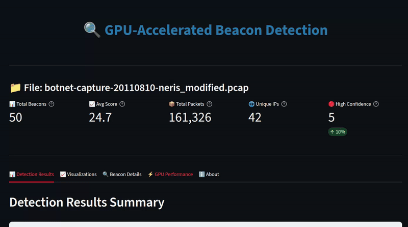
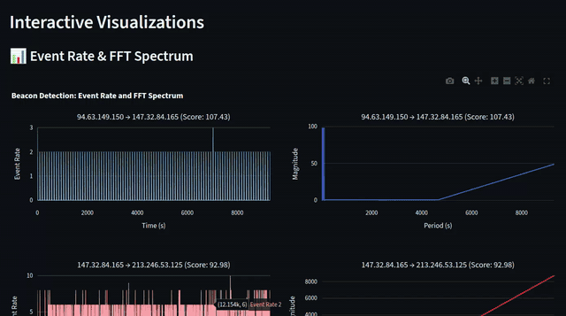

# GPU-Accelerated Beacon Detection

GPU-accelerated frequency domain analysis for detecting periodic command-and-control (C2) traffic in network captures. Optimized for NVIDIA RTX 5090 using RAPIDS (cuDF, CuPy, cuSignal).

## 🎯 Overview

**Command-and-control (C2) beaconing** is a critical cybersecurity threat where compromised systems periodically communicate with attacker-controlled servers to receive instructions, exfiltrate data, and maintain persistent access. Traditional detection methods struggle with modern botnets that use sophisticated evasion techniques: **jittered timing** (random delays), **domain generation algorithms (DGAs)**, and **low-frequency communication** that blends into normal network traffic. This project addresses these challenges by leveraging **GPU-accelerated digital signal processing (DSP)** to detect periodic patterns in network traffic that are invisible to rule-based systems. By applying Fast Fourier Transform (FFT) analysis across thousands of IP pairs simultaneously on GPU, we can identify subtle periodicities—even with 40% jitter—that indicate malicious beaconing behavior. This approach transforms network security from reactive signature-matching to proactive pattern recognition, enabling detection of zero-day botnets and advanced persistent threats (APTs) that evade traditional security tools.

---

## 📸 **Screenshots & Demos**

### **Live Demos (Animated)**

#### **🔍 GPU-Accelerated Beacon Detection (Overview)**



*Overview of the GPU-accelerated beacon detection system with Streamlit interface.*

---

## Requirements

- NVIDIA GPU with CUDA support (RTX 5090 recommended)
- Python 3.10
- Conda environment `cyberone`

## Installation

```bash
# Create environment
conda create -n cyberone python=3.10 -y
conda activate cyberone

# Install RAPIDS stack
conda install -c rapidsai -c conda-forge -c nvidia cupy cusignal cudf -y

# Install dependencies
pip install -r requirements.txt
```

## Usage

### Launch Streamlit App

```bash
conda activate cyberone
streamlit run app.py
```

The app will open in your browser at `http://localhost:8501`

## Workflow & User Interface

### 1. Upload PCAP File

Click the **"Choose PCAP file"** button in the sidebar and select your network capture file. The app automatically:
- Validates the PCAP format
- Saves it temporarily for processing
- Triggers GPU-accelerated detection (~2-5 seconds)

### 2. Overview Tab

After detection completes, the **Overview** tab displays:

- **Key Metrics** (with tooltips):
  - Total Beacons Detected
  - Average Periodicity Score
  - Total Packets Processed
  - Unique IP Pairs Analyzed

- **Top Beacons Table**: Ranked list of detected periodic patterns with:
  - Periodicity Score
  - Estimated Period (seconds)
  - Source/Destination IPs
  - Packet Count
  - Peak FFT Magnitude

### 3. Visualization Tab

Interactive visualizations showing detection results:

#### **📊 Event Rate & FFT Spectrum**



*Time-domain event rate (top) and frequency-domain FFT spectrum (bottom) for top 5 detected beacons. The FFT reveals periodic patterns as sharp peaks above the noise floor.*

---

#### **📈 Power Spectral Density (PSD) Comparison**


*Compares the spectral density of top 3 detected beacons against a benign background. Higher PSD values indicate stronger periodic signals, demonstrating the Signal-to-Noise Ratio (SNR) advantage of the detection algorithm.*

---

#### **📊 3D Spectrogram**


*Interactive 3D visualization showing Frequency vs. Time vs. Magnitude (log-scale) for the primary infected host. Rotate and zoom to explore periodic patterns across the entire capture duration.*

### 4. Detailed Analysis Tab

- **Beacon Selection**: Dropdown to select any detected beacon
- **Individual Metrics**: Periodicity score, estimated period, packet statistics
- **DSP Methodology**: Explanation of Fast Fourier Transform (FFT) and signal processing techniques used
- **CSV Export**: Download detailed records for selected IP pairs

### 5. GPU Performance Tab

Real-time GPU statistics using `nvidia-smi`:
- GPU Utilization (%)
- Memory Usage (GB)
- Batch Processing Metrics
- CUDA Function Performance

### 6. Stop Detection

Use the **"Stop Detection"** button to terminate background processing if needed.

## Project Files

- `app.py` - **Streamlit web interface** - Main entry point for interactive analysis
- `gpu_detector.py` - GPU-accelerated FFT-based detection engine (cuDF + CuPy + cuSignal)
- `visualize.py` - Visualization module for generating plots
- `requirements.txt` - Python dependencies
- `run_streamlit.sh` - Convenience script to launch Streamlit app
- `botnet-capture-20110810-neris_modified.pcap` - Sample PCAP file (75MB) with synthetic beacons

## Performance

- **PCAP Loading:** ~2.4s for 77MB file (18x faster with dpkt)
- **GPU Throughput:** 37,000+ IP pairs/second on RTX 5090
- **Processing:** Fully GPU-accelerated using RAPIDS stack
- **Memory:** Optimized batching handles large PCAPs without OOM

## Detection Algorithm

1. Load PCAP to cuDF DataFrame (GPU)
2. Create batched time-series matrix (GPU)
3. Apply Hanning window and detrending (GPU)
4. Batched FFT across all IP pairs (GPU)
5. Calculate periodicity scores (GPU)
6. Filter and rank results (CPU)

**Periodicity Score = Peak Magnitude / Median Noise Floor**

## Dataset

The project includes `botnet-capture-20110810-neris_modified.pcap` (75MB), a modified version of the CTU-13 botnet capture dataset. This file contains:
- Original Neris botnet traffic from the infected host `147.32.84.165`
- Synthetic C2 beacon patterns with varying jitter profiles for demonstration

**Original Dataset**: The CTU-13 dataset (2011) is publicly available for research purposes from the [Stratosphere Laboratory](https://www.stratosphereips.org/datasets-ctu13). The botnet-only PCAP files can be downloaded from their website.

**Note**: The modified PCAP file is included in this repository for demonstration purposes. If you need the original unmodified capture, download it from the CTU-13 dataset website.

## Real-Time Streaming Extensions

This project focuses on **batch processing** of captured PCAP files for offline analysis. However, for users interested in **real-time network monitoring** with live traffic streams, several solutions can extend this work:

**NVIDIA Holoscan** is a powerful SDK for building real-time streaming applications that could be adapted for continuous network monitoring. Holoscan provides:
- Low-latency streaming pipelines optimized for edge AI workloads
- Real-time data processing with GPU acceleration
- Integration with sensor data streams and network interfaces
- Deterministic scheduling for time-critical applications

For real-time beacon detection, you could:
1. Stream live network traffic (via libpcap, DPDK, or similar)
2. Process packets in real-time using Holoscan's pipeline framework
3. Apply the same GPU-accelerated FFT analysis on streaming windows
4. Trigger alerts when periodic patterns are detected

**Alternative approaches** for real-time monitoring include:
- **Apache Kafka** + **Kafka Streams** for distributed real-time processing
- **Apache Flink** for stateful stream processing
- **NVIDIA DeepStream** for video/network analytics pipelines
- **eBPF/XDP** for kernel-level packet processing

The current batch-oriented approach provides a solid foundation for understanding beacon detection algorithms, which can then be adapted for real-time use cases.

## License

This project is provided as-is for research and educational purposes under the MIT License.

**⚠️ SECURITY DISCLAIMER**: This software is a proof-of-concept tool and does NOT provide security guarantees. The authors are NOT LIABLE for any security breaches, data loss, or damages resulting from use or misuse of this software. USE AT YOUR OWN RISK. See [LICENSE](LICENSE) for full details.
