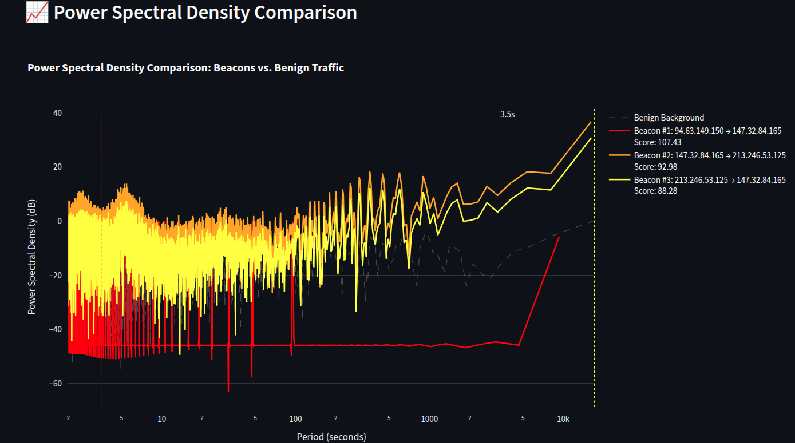

# GPU-Accelerated Beacon Detection

GPU-accelerated frequency domain analysis for detecting periodic command-and-control (C2) traffic in network captures. Optimized for NVIDIA RTX 5090 using RAPIDS (cuDF, CuPy, cuSignal).

https://github.com/Pouria-007/gpu-accelerated-dsp-beacon-detection/blob/main/docs/images/GPU-Accelerated_Beacon_Detection.webm

> **📹 [Watch Demo Video](docs/images/GPU-Accelerated_Beacon_Detection.webm)** - Overview of the GPU-accelerated beacon detection system

## Requirements

- NVIDIA GPU with CUDA support (RTX 5090 recommended)
- Python 3.10
- Conda environment `cyberone`

## Installation

```bash
# Create environment
conda create -n cyberone python=3.10 -y
conda activate cyberone

# Install RAPIDS stack
conda install -c rapidsai -c conda-forge -c nvidia cupy cusignal cudf -y

# Install dependencies
pip install -r requirements.txt
```

## Usage

### Launch Streamlit App

```bash
conda activate cyberone
streamlit run app.py
```

The app will open in your browser at `http://localhost:8501`

## Workflow & User Interface

### 1. Upload PCAP File

Click the **"Choose PCAP file"** button in the sidebar and select your network capture file. The app automatically:
- Validates the PCAP format
- Saves it temporarily for processing
- Triggers GPU-accelerated detection (~2-5 seconds)

### 2. Overview Tab

After detection completes, the **Overview** tab displays:

- **Key Metrics** (with tooltips):
  - Total Beacons Detected
  - Average Periodicity Score
  - Total Packets Processed
  - Unique IP Pairs Analyzed

- **Top Beacons Table**: Ranked list of detected periodic patterns with:
  - Periodicity Score
  - Estimated Period (seconds)
  - Source/Destination IPs
  - Packet Count
  - Peak FFT Magnitude

### 3. Visualization Tab

Interactive visualizations showing detection results:

**Event Rate & FFT Spectrum**

> **📹 [Watch Video](docs/images/EventRate_and_FFT_Spectrum.webm)** - Interactive visualization of event rate and FFT spectrum

Shows time-domain event rate (top) and frequency-domain FFT spectrum (bottom) for top 5 detected beacons. The FFT reveals periodic patterns as sharp peaks above the noise floor.

**Power Spectral Density (PSD) Comparison**


Compares the spectral density of top 3 detected beacons against a benign background. Higher PSD values indicate stronger periodic signals, demonstrating the Signal-to-Noise Ratio (SNR) advantage of the detection algorithm.

**3D Spectrogram**

> **📹 [Watch Video](docs/images/3D-Spectrogram.webm)** - Interactive 3D spectrogram visualization

Interactive 3D visualization showing Frequency vs. Time vs. Magnitude (log-scale) for the primary infected host. Rotate and zoom to explore periodic patterns across the entire capture duration.

### 4. Detailed Analysis Tab

- **Beacon Selection**: Dropdown to select any detected beacon
- **Individual Metrics**: Periodicity score, estimated period, packet statistics
- **DSP Methodology**: Explanation of Fast Fourier Transform (FFT) and signal processing techniques used
- **CSV Export**: Download detailed records for selected IP pairs

### 5. GPU Performance Tab

Real-time GPU statistics using `nvidia-smi`:
- GPU Utilization (%)
- Memory Usage (GB)
- Batch Processing Metrics
- CUDA Function Performance

### 6. Stop Detection

Use the **"Stop Detection"** button to terminate background processing if needed.

## Project Files

- `app.py` - **Streamlit web interface** - Main entry point for interactive analysis
- `gpu_detector.py` - GPU-accelerated FFT-based detection engine (cuDF + CuPy + cuSignal)
- `visualize.py` - Visualization module for generating plots
- `requirements.txt` - Python dependencies
- `run_streamlit.sh` - Convenience script to launch Streamlit app
- `botnet-capture-20110810-neris_modified.pcap` - Sample PCAP file (75MB) with synthetic beacons

## Performance

- **PCAP Loading:** ~2.4s for 77MB file (18x faster with dpkt)
- **GPU Throughput:** 37,000+ IP pairs/second on RTX 5090
- **Processing:** Fully GPU-accelerated using RAPIDS stack
- **Memory:** Optimized batching handles large PCAPs without OOM

## Detection Algorithm

1. Load PCAP to cuDF DataFrame (GPU)
2. Create batched time-series matrix (GPU)
3. Apply Hanning window and detrending (GPU)
4. Batched FFT across all IP pairs (GPU)
5. Calculate periodicity scores (GPU)
6. Filter and rank results (CPU)

**Periodicity Score = Peak Magnitude / Median Noise Floor**

## Dataset

The project includes `botnet-capture-20110810-neris_modified.pcap` (75MB), a modified version of the CTU-13 botnet capture dataset. This file contains:
- Original Neris botnet traffic from the infected host `147.32.84.165`
- Synthetic C2 beacon patterns with varying jitter profiles for demonstration

**Original Dataset**: The CTU-13 dataset (2011) is publicly available for research purposes from the [Stratosphere Laboratory](https://www.stratosphereips.org/datasets-ctu13). The botnet-only PCAP files can be downloaded from their website.

**Note**: The modified PCAP file is included in this repository for demonstration purposes. If you need the original unmodified capture, download it from the CTU-13 dataset website.

## License

This project is provided as-is for research and educational purposes.
